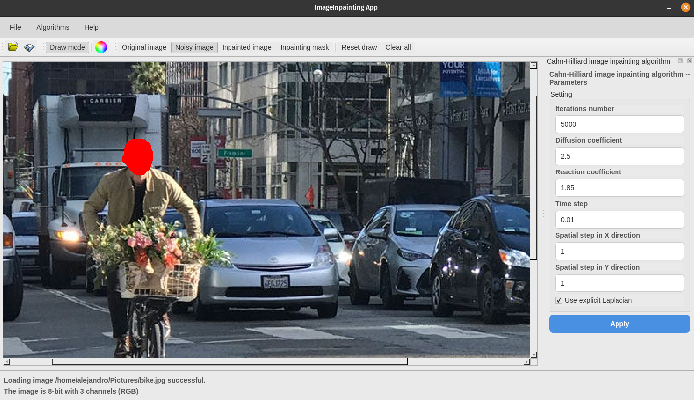
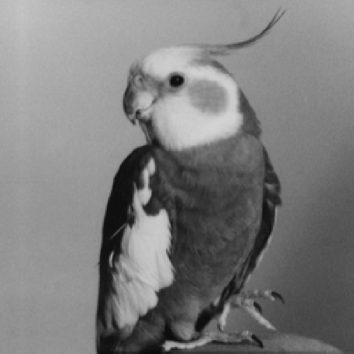
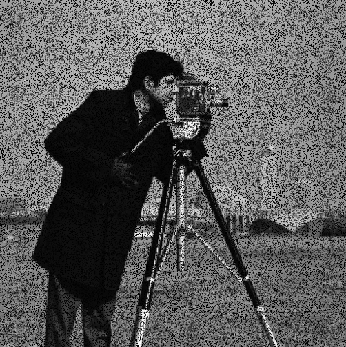
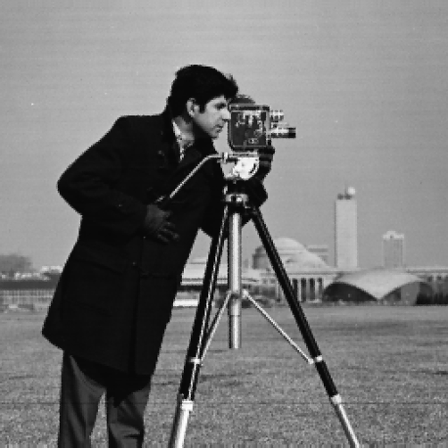
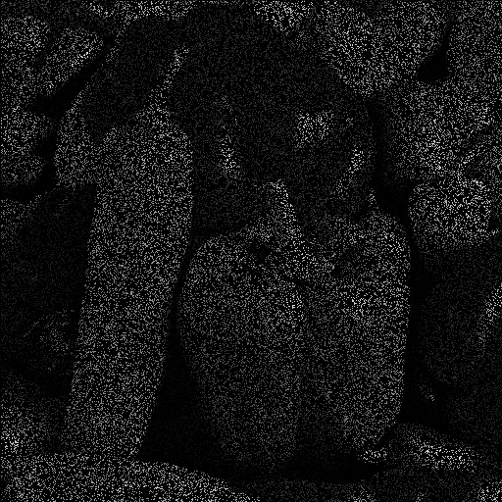
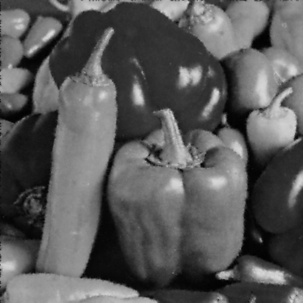

# image-inpainting-app
A Qt-based application to restore images with various inpainting methods.

This is also a _reservoir_ for image inpainting algorithms in C++ (for personal amusement).

  

<table border="1" style="border-collapse: collapse; text-align: center;">
  <tr>
    <th>Original</th>
    <th>Inpainted</th>
  </tr>
  <tr>
    <td></td>
    <td></td>
  </tr>
  <tr>
    <td></td>
    <td></td>
  </tr>
  <tr>
    <td></td>
    <td></td>
  </tr>
</table>

# Installation

The application is fully packed inside a Docker container, check [these instructions](./docker) to get started.

The app has been tested on the following platforms:

* Pop!_OS 22.04 LTS with Qt 6.8.1, Qt Creator 15.0.0 and GCC 11.4.0.

# Usage

The app consists of a self-explanatory GUI and it contains a useful Help file. The following table explains the functionality for the GUI icons:

| Icon | Functionality |
|---------- | ---------- |
|  | Import image |
|  | Save image |
|  | Show information about the application |
|  | Activate pencil drawing mode (only available in `Noise` image mode) |
|  | Adjust pencil properties |
| `Original image` | Show original image |
| `Noisy image` | Show noisy image |
| `Inpainted image` | Show inpainted image |
| `Inpainting mask` | Show inpainting mask |
| `Clear all` | Clear all images and setup |
| `Reset draw` | Reset pencil drawing |
| `Noise` | Add noise to the image |
| `XYZ Image Inpainting` | Use your favourite image inpainting algorithm |

### Available algorithms

| Algorithm | Description | Link / Reference |
|-----------|-------------|---------------------|
| **BurgersViscousImageInpainting** | Implements the inpainting algorithm based on the viscous Burgers' equation | [Burgers Equation](https://arxiv.org/abs/2412.11946) |
| **CahnHilliardImageInpainting** | Implements the inpainting algorithm based on the Cahn-Hilliard equation  | [Cahn-Hilliard Equation](https://arxiv.org/abs/2412.11946) |
| **MaxwellHeavisideImageInpainting** | Implements the inpainting algorithm based on the Maxwell-Heaviside equations | [Maxwell-Heaviside Theory](https://arxiv.org/abs/2412.11946) |
| **NavierStokesImageInpainting** | Executes the image inpainting algorithm from OpenCV based on Navier-Stokes equations | [OpenCV Navier-Stokes](https://docs.opencv.org/3.4/d7/d8b/group__photo__inpaint.html#gga8c5f15883bd34d2537cb56526df2b5d6a05e763003a805e6c11c673a9f4ba7d07) |
| **TeleaImageInpainting** | Executes the TELEA algorithm from OpenCV | [Telea Inpainting](https://docs.opencv.org/3.4/d7/d8b/group__photo__inpaint.html#gga8c5f15883bd34d2537cb56526df2b5d6a892824c38e258feb5e72f308a358d52e) |
| **CriminisiImageInpainting** | Implements Criminisi inpainting, based on [cheind](https://github.com/cheind/inpaint) | [Criminisi](https://www.irisa.fr/vista/Papers/2004_ip_criminisi.pdf) |
| **FastDigitalImageInpainting** | Implements Fast Digital Image Inpainting, based on [this](https://github.com/Mugichoko445/Fast-Digital-Image-Inpainting) | [Paper](https://www.inf.ufrgs.br/~oliveira/pubs_files/inpainting.pdf) |
| **LaplacianImageInpainting** | Implements Laplacian Digital Image Inpainting, based on [this](https://github.com/KAIST-VCLAB/laplacianinpainting) | [Paper](http://vclab.kaist.ac.kr/cvpr2016p2/CVPR2016_LaplacianInpainting.pdf) |
| **HarmonicInpainting** | Heat (Harmonic) Equation Image Inpainting | [Carola-Bibiane Schönlieb](https://es.mathworks.com/matlabcentral/fileexchange/34356-higher-order-total-variation-inpainting?status=SUCCESS) |
| **...** | ... | [...]() |

---
# TODO
* Mejorar lo de esconder y mostrar las labels. Por ejemplo, unir en un solo el label de mensaje temporal y tipo de imagen.
* Crear GIF de funcionamiento para el README
* Meter estadísticas de PSNR, MSE y SSIM tras hacer el inpainting
* Explicaciones de app e iconos en README. Enlazar el README en hipervínculo desde el About de la aplicación
* Explicaciones someras con ejemplo visuales de qué algoritmo va mejor para qué caso
* Gran problema: cuando se cambia grosor del lápiz, que no afecte al dibujo anterior, o sea, guardar el histórico de tuplas paths-grosor, no solo path.
* No aparece al brush style por defecto en docker, al cambiar el estilo del lápiz, por qué. 
* Distribuir la imagen docker de la aplicación en Docker Registry o subirla el .tar a algún lado
* Release the app in AppImage format 
* Implementar los algoritmos comentados en [este README](./src/ImageInpainting/Algorithms/README.md)
* Diseñar un botón de "parar algoritmo" para abortar el procesamiento de CalculationThread
* Añadir el parámetro drawWhites al tipo de ruido; no sé qué problema daba el validador con tipo booleano.

# References
* [Inspired by GuidedDenoising](https://github.com/bldeng/GuidedDenoising)
